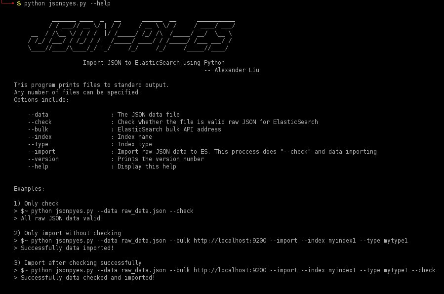

json-py-es
==========
Alexander Liu
* To import raw JSON data files to ElasticSearch using Python

> Using ElasticSearch Bulk API to import this data, sometimes ES only recognizes data in its request style. Now let `json-py-es` glue them all.


jsonpyes
--------


#### Instructions:
    There are 3 proccesses of importing raw JSON data to ElasticSearch
    1. Only validating raw JSON data
    2. Without validating ,just import data to ElasticSearch
    3. After validating successfully, then import data to ElasticSearch


##### 1. Only validating
* ```python jsonpyes.py --data raw_data.json --check```

* If the json data file is valid: 


* If the json data file is invalid: 


##### 2. Only importing without validating
* Notice: If the raw JSON data file is invalid, ElasticSearch will not import it.
* ```python jsonpyes.py --data raw_data.json --bulk http://localhost:9200 --import --index myindex2 --type mytype2```


* And it works.


##### 3. Both validating and importing
* ```python jsonpyes.py --data raw_data.json --bulk http://localhost:9200 --import --index myindex1 --type mytype1 --check```


* And it works.


##### Happy Hacking!
